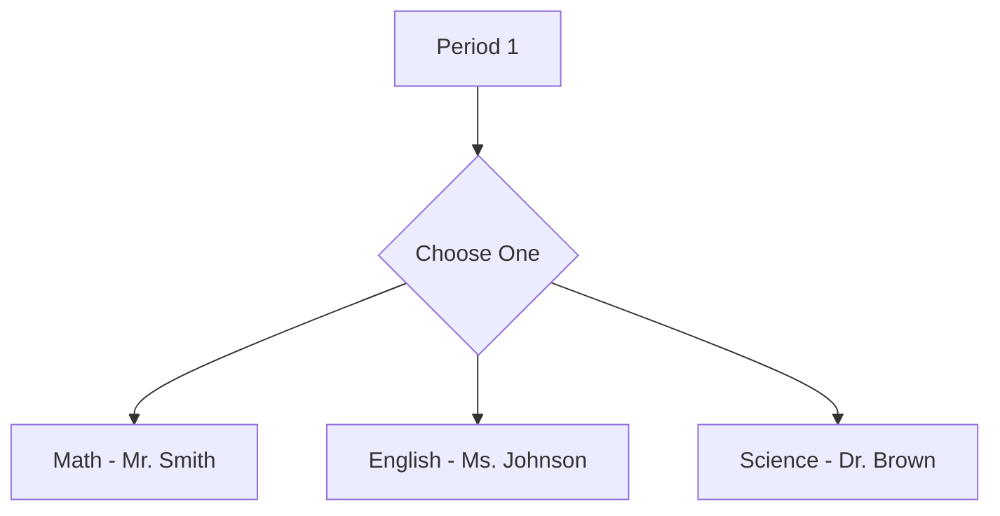
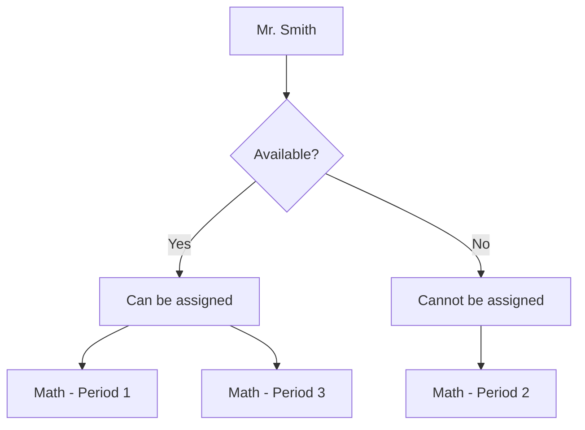
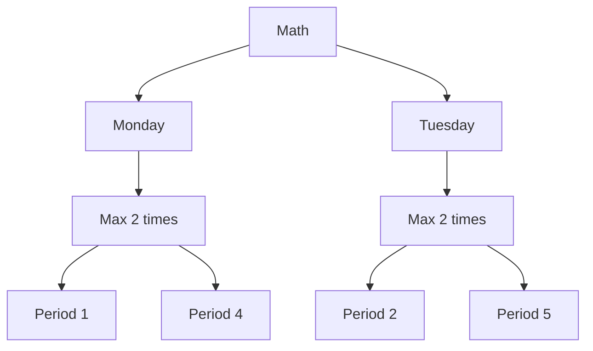
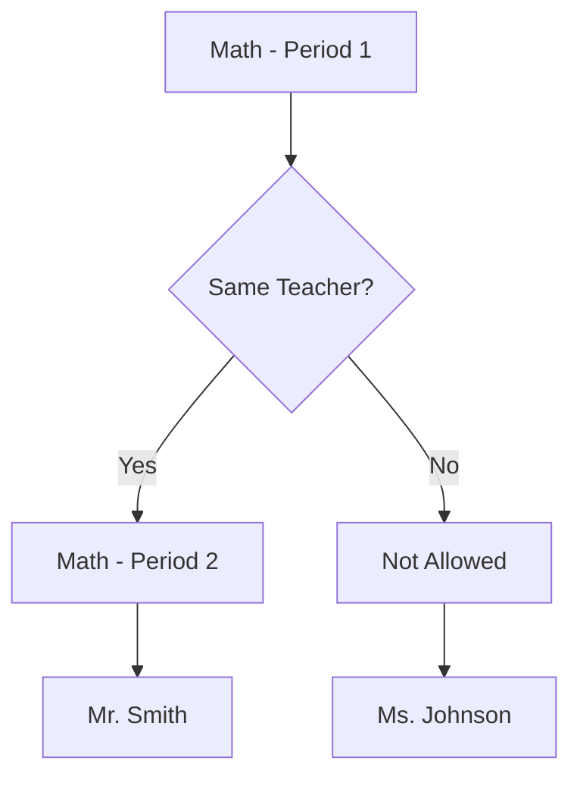
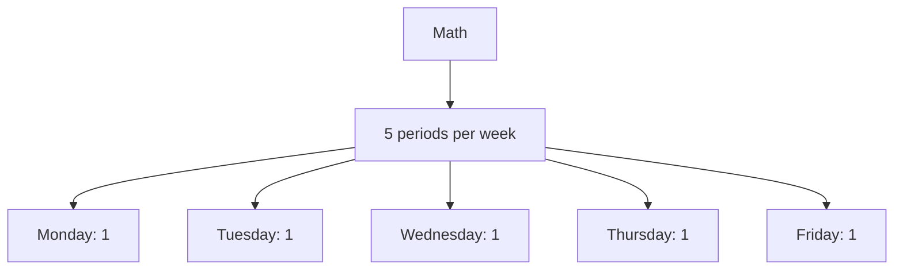
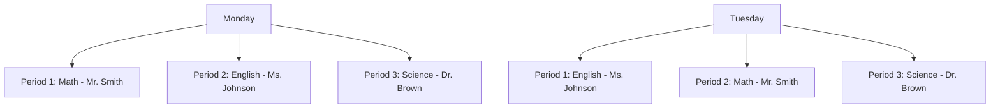

# School Timetable Generator Documentation

## Overview

This Python script generates optimal school timetables using constraint programming. It takes input data from a JSON file, applies various constraints, and outputs multiple solution timetables in both JSON and CSV formats.

## Table of Contents

1. [Dependencies](#dependencies)
2. [Input Data](#input-data)
3. [Code Structure](#code-structure)
4. [Constraint Model](#constraint-model)
5. [Solver Configuration](#solver-configuration)
6. [Solution Output](#solution-output)
7. [Usage](#usage)

## Dependencies

The script uses the following libraries:

- `json`: For reading input data and writing output solutions
- `csv`: For writing timetable solutions in CSV format
- `ortools.sat.python.cp_model`: Google's OR-Tools library for constraint programming

## Input Data

The script expects a JSON file (`input_data.json`) with the following structure:

- `class_schedule`: A dictionary of days and their respective schedules
- `periods_per_day`: Number of periods for each day
- `teachers`: List of teacher objects with subjects they can teach and availability
- `subject_periods`: Required number of periods per week for each subject

## Code Structure

1. **Data Loading**: The script starts by loading the input data from the JSON file.

2. **Model Creation**: A constraint programming model is created using OR-Tools.

3. **Variable Definition**: Boolean variables are created for each possible assignment of a subject to a period, day, and teacher.

4. **Constraint Definition**: Various constraints are added to the model to ensure a valid timetable.

5. **Solver Configuration**: The CP-SAT solver is configured with specific parameters.

6. **Solution Generation**: A custom solution printer is used to generate and store multiple solutions.

7. **Output Generation**: Solutions are saved in JSON format and individual CSV timetables.

## Constraint Model

The script implements several constraints to generate valid timetables:

1. Each period must have exactly one subject assigned, taught by an available teacher.
2. Teachers can only be assigned during their available periods.
3. Each subject is assigned at most twice per day.
4. Consecutive assignments of the same subject on the same day are handled by the same teacher.
5. Each subject is assigned the required number of periods per week.

## Solver Configuration

The solver is configured with the following parameters:

- `log_search_progress = True`: Enables logging of the search progress
- `max_time_in_seconds = 10`: Sets a time limit of 10 seconds for the solver

## Solution Output

The script generates two types of output:

1. **JSON Output**: A file named `solutions.json` containing up to three different timetable solutions.

2. **CSV Output**: Individual CSV files for each solution, formatted as a weekly calendar with days as columns and periods as rows.

## Usage

1. Prepare the `input_data.json` file with the required school data.
2. Run the script: `python timetable_generator.py`
3. Check the output folder for the generated `solutions.json` and CSV timetables.

Note: The script is currently set to generate up to 3 solutions. This can be adjusted by modifying the `limit` parameter in the `SolutionPrinter` class instantiation.

## Tutorial: Understanding the Constraints

This section provides a visual guide to the constraints used in the timetable generator. Each constraint is explained with a diagram to illustrate its effect on the timetable.

### 1. One Subject Per Period

This constraint ensures that each period has exactly one subject assigned, taught by an available teacher. The model must choose one and only one option for each period.

### 2. Teacher Availability

Teachers can only be assigned during their available periods. In this example, Mr. Smith is available for periods 1 and 3, but not for period 2.

### 3. Subject Frequency Per Day

Each subject is assigned at most twice per day. This prevents a single subject from dominating a day's schedule.

### 4. Consecutive Assignments

Consecutive assignments of the same subject on the same day must be handled by the same teacher. This ensures continuity in teaching.

### 5. Required Periods Per Week

Each subject is assigned the required number of periods per week. In this example, Math needs to be scheduled for exactly 5 periods across the week.

### Applying Constraints

When all these constraints are applied together, the model creates a timetable that satisfies all requirements. Here's a simplified example of how a partial timetable might look:

This visual representation shows how different subjects and teachers are assigned to periods while adhering to all the defined constraints.

## Conclusion

By visualizing these constraints, we can better understand how the timetable generator works to create optimal schedules. The constraint programming model considers all these rules simultaneously to find solutions that satisfy all requirements.